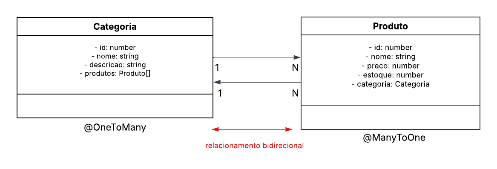

<h1 align="center">💊 <br>CRUD Farmácia — NestJS</h1>

<p align="center">
  Este projeto consiste em uma <strong>API RESTful</strong> para gerenciamento de uma <strong>Farmácia</strong>, desenvolvida com <strong>NestJS</strong> e <strong>TypeORM</strong>, permitindo o cadastro, consulta, atualização e remoção de <strong>Categorias</strong> e <strong>Produtos</strong>, com relacionamento entre as entidades. 
  O projeto foi desenvolvido com fins <strong>educacionais</strong>, aplicando conceitos de <strong>CRUD</strong>, <strong>arquitetura modular</strong>, <strong>relacionamentos entre entidades</strong> e <strong>boas práticas de desenvolvimento backend</strong>.

</p>

<p align="center">
  
  
  
  
</p>

---

## Visão Geral

Este projeto representa o desenvolvimento de uma **API RESTful para um Sistema de Farmácia**, permitindo o gerenciamento de **Categorias** e **Produtos**, com relacionamento entre as entidades e validações de regras de negócio.

Desenvolvido durante o **bootcamp da Generation Brasil**, com o objetivo de consolidar conhecimentos em:

- **• NestJS**
- **• TypeORM**
- **• Banco de Dados Relacional**
- **• Arquitetura de APIs REST**

---

## Conceitos Aplicados

- ✔ Arquitetura em camadas (**Controller, Service, Entity**)
- ✔ Relacionamento **OneToMany / ManyToOne**
- ✔ Relacionamento bidirecional entre entidades
- ✔ Validações nos métodos **create** e **update**
- ✔ Busca parcial com **LIKE**
- ✔ Tratamento de exceções HTTP
- ✔ Boas práticas de organização de código

---

## Stack Tecnológica

<div align="center">
  
| Tecnologia | Descrição |
|-----------|----------|
| **TypeScript** | Linguagem principal |
| **Node.js** | Ambiente de execução |
| **NestJS** | Framework backend |
| **TypeORM** | ORM para acesso ao banco |
| **MySQL** | Banco de dados relacional |
| **Insomnia** | Testes da API |
| **Git / GitHub** | Versionamento de código |

</div>

---

## Arquitetura do Projeto

O projeto segue a arquitetura padrão do **NestJS**, separando responsabilidades em camadas bem definidas:

- **Entity** → Representação das tabelas do banco de dados
- **Service** → Regras de negócio e acesso aos dados
- **Controller** → Definição das rotas e tratamento das requisições HTTP

Essa abordagem garante maior **organização**, **manutenibilidade** e **escalabilidade** do sistema.

---

## Diagrama de Classes (UML)

O diagrama abaixo representa o **modelo de classes da aplicação**, evidenciando as entidades
**Categoria** e **Produto**, além do relacionamento entre elas.

<div align="center">
  
</div>

### Relacionamento entre Entidades

- **Categoria** → OneToMany → **Produto**
- **Produto** → ManyToOne → **Categoria**
- Relação **bidirecional**

---

## Funcionalidades

<div align="center">

|  Categoria |  Produto |
|:------------:|:----------:|
| **POST** `/categoria` <br> Criar categoria | **POST** `/produto` <br> Criar produto |
| **GET** `/categoria` <br> Listar categorias | **GET** `/produto` <br> Listar produtos |
| **GET** `/categoria/{id}` <br> Buscar por ID | **GET** `/produto/{id}` <br> Buscar por ID |
| **GET** `/categoria/nome/{nome}` <br> Buscar por nome (LIKE) | **GET** `/produto/nome/{nome}` <br> Buscar por nome (LIKE) |
| **PUT** `/categoria` <br> Atualizar categoria | **PUT** `/produto` <br> Atualizar produto |
| **DELETE** `/categoria/{id}` <br> Remover categoria | **DELETE** `/produto/{id}` <br> Remover produto |

</div>

---

## Validações & Regras de Negócio

- ✔ Validação de campos obrigatórios
- ✔ Verificação de existência antes de **update** e **delete**
- ✔ Tratamento de exceções com **HTTP Status adequados**
- ✔ Garantia de relacionamento válido entre Produto e Categoria

---

## Testes

Os testes da aplicação foram realizados utilizando o **Insomnia**, validando:

- • CRUD completo de Categoria
- • CRUD completo de Produto
- • Relacionamento entre entidades
- • Validações de regras de negócio
- • Respostas HTTP corretas

---

## Como Executar o Projeto

```bash
# Clonar o repositório
git clone https://github.com/alissasousadev/pharmacy-management-backend.git

# Instalar dependências
npm install

# Executar a aplicação
npm run start:dev
```

---

<div align="center">
  <p>
    <em>
<strong>Projeto desenvolvido com fins educacionais</strong>, no contexto da formação oferecida pela <strong>Generation Brasil</strong>, consistindo na implementação de um <strong>Sistema de Farmácia</strong>, com foco na aplicação dos conceitos de <strong>Programação Orientada a Objetos (POO)</strong>, <strong>arquitetura em camadas</strong> e <strong>desenvolvimento de APIs RESTful</strong>, utilizando boas práticas de organização e estruturação de código.


 </em>
  </p>
</div>
